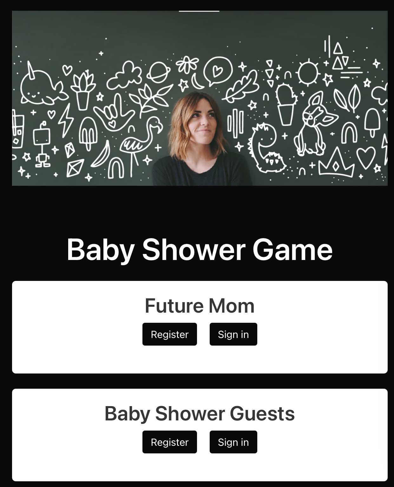

<h1  align="center">Baby Game</h1>

## Table of Contents
-  [Team Members](#team-members)

-  [About the Project](#about-the-project)

-  [Motivation](#motivation)

-  [Project Demo](#project-demo)

-  [Future Development](#future-development)

-  [Acknowledgments](#acknowledgements)

  

## Team Members

- Melany Pietrowski
- Jonathon Schoenholz
- Kenia Lizama-Gamez

## About the Project
Our website lets a future mom register as a user. Her baby shower guests can find her and make their votes under her page. Everyone who joins her page can see all other guests votes.  Whoever’s guesses the closest to the baby’s specifics, wins a prize. 

  

### User Story:
AS A future mom 
I WANT a searchable posts' website
SO THAT my baby shower guests can vote on my baby’s gender, weight, and DOB

## Motivation
There is not currently a website that lets a future baby mama have her guests make the stereotypical guesses in one organized place. Some moms use old styled excel sheets that she must populate herself. It's hard to keep up with everyone’s votes. 
  

## Project-Demo
[Baby Shower Game](https://baby-shower-game.herokuapp.com)

  

## Future Development
1. Add a like button capability on guests posts
2. Add a table that displays votes and users in ascending order by date and/or weight
3. Add a table that separates who voted for girl or boy
4. Make the voting card into a quiz like game instead of stationary form
Searchable “Find baby mama” if you don’t know her email address
5. Add an additional “suggest a name” field
6. Game option- competition. Place everyone’s votes by date. If your guessed date passed and baby wasn’t born, you are eliminated. If your guessed date comes after baby is born, you are eliminated.  If more than one guest guessed the right date, the elimination continues based on who is closest to the baby’s weight to find a winner. 
  

## Acknowledgments
- [Handlebars](https://handlebarsjs.com/)
- [Sequelize](https://sequelize.org/v5/)
- [MySQL](https://www.mysql.com/)
- [Bulma](https://bulma.io/)

